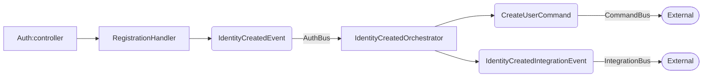
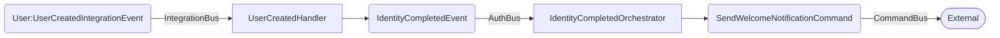
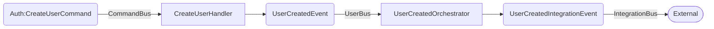
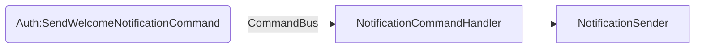
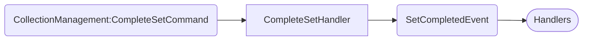
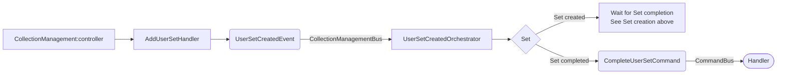
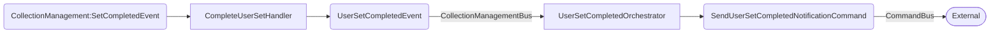

# Messages / events

Note: there are probably much better ways to document (and implement !) events / messaging, but for now it will do its job as a reminder when things get complicated.

## Overview

### Messages types
There are 3 messages types which technically are of the same form : a payload as an array, and specific data as attributes.
The payload and common functionality is carried by the Message base class. 
The difference lies in intentionality :
- Classes extending DomainEvent are only "local" to each module, must only be produced by aggregates and dispatched to the local module bus only, and should be handled by only one local handler 
- Classes extending IntegrationEvent are meant to be sent outside a module, and be handled by one or many handlers
- Classes extending Command are meant to be sent as commands to the outside world, and must be handler by one and only one handler, although this is by convention and is not programmatically enforced

### Buses (i.e. symfony messenger buses)
- Each module with aggregates producing events MUST have its own "private" bus.
- These local buses are configured in config/packages/messengers.
- A local bus MUST not be used by another module as this would imply coupling between modules
- The 'integration' bus is dedicated to IntegrationEvents
- The 'command' bus is dedicated to Commands

### Transports (i.e. symfony messenger transports)
- sync transport (in memory) for synchronous operations
- async transport (with rabbitmq) for asynchronous operations
- by default, IntegrationEvents and Commands are routed through the async transport
- in some cases, it is possible to send a Command or an IntegrationEvent on the sync transport, although this is not 
advised ; and as for now, this would **add the sync transport**, **not replace the async**, so **the message would be routed on both** ; be **extra careful** with this  
- local DomainEvent are sent through the sync transport only  

### Infrastructure Handlers (i.e. symfony messenger handlers)
- handlers should be in the module's Infrastructure/EventHandler and must implement the appropriate interface :
`DomainEventHandler` for local handlers,
`IntegrationEventHandler` for IntegrationEvent handlers,
`CommandHandler` for Command handlers
- there are "contracts" in integration test, which are able to check if a certain type of Message is handled by a module ; 
see `tests/[Module]/Integration/Infrastructure/EventHandler/ContractIT`  
- handlers have the `#[AsMessageHandler]` attribute and may specify a target transport and/or priority ; target transport 
should be used only for Messages that could be received from multiple transport, although sending Messages to both async 
and sync transports should be discouraged (or better forbidden)
- infrastructure handlers should be simple proxies to application handlers or orchestrators
typically, a local `DomainEvent` should be optionally handled by a local application handler and/or passed to an 
application `Orchestrator` if external relay is needed

## Flow

### Auth module events

### User module events

### Notification module events

### CollectionManagement module events

Set creation

Note : no orchestrator for the SetCompletedEvent, because this one stays internal only and does not need to generate integration events or commands.

UserSet creation

UserSet completion

